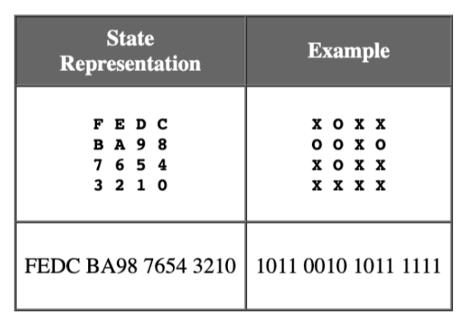

# Heuristic Pegboard Solver
The pegboard puzzle is a classic game where pegs are arranged on a board with one empty slot, and the goal is to remove all but one peg by jumping one peg over another into an empty slot. This project implements a solver for the pegboard problem, leveraging heuristic-based search methods and random exploration strategies.

The initial board state is represented as an integer (e.g., `65023`), which is converted into a binary representation. Each bit corresponds to a slot on the board: `1` for a filled slot (peg) and `0` for an empty slot. This binary representation is then mapped to an `n x n` square grid. 




## Methodology

This project aims to provide a comprehensive solution to the pegboard puzzle by combining brute-force exploration with heuristic-guided search algorithms. The methodology leverages systematic state and action representations to enable efficient problem-solving techniques.

- **State Representation**: Models the pegboard state as a binary grid to represent pegs (`1`) and empty slots (`0`) in an `n x n` layout.
  <br><br>
- **Action Representation**: Defines the possible moves (peg jumps) that transition the pegboard from one state to another. Each action specifies the starting peg, the jumped peg, and the destination slot.
  <br><br>
- **Flail Wildly**: A brute-force exploration method where random valid actions are iteratively applied until either a solution is found or no further actions are possible. This method is inefficient but serves as a baseline for comparison.
  <br><br>
- **Search Algorithms**: Implements depth-first search (DFS) and A* search with various heuristics:
  <br><br>
  - **DFS**: Explores all paths exhaustively, diving deep into one branch before backtracking. It guarantees finding a solution if one exists but is not optimal.
    <br><br>
  - **Heuristic 1**: Prioritizes states with more valid actions remaining, assuming greater flexibility may lead to a solution.
    <br><br>
  - **Heuristic 2**: Minimizes the sum of Manhattan distances from all pegs to the initial empty slot, favoring spatial convergence.
    <br><br>
  - **Heuristic 3**: Combines peg reduction and Manhattan distances, assigning higher weight to reducing the number of pegs.
    <br><br>
  - **A\* with Heuristic 1**: Balances the cost of reaching the current state (`g(n)`) with Heuristic 1 to guide the search.
    <br><br>
  - **A\* with Heuristic 2**: Uses Heuristic 2 to prioritize states closer to the goal spatially.
    <br><br>
  - **A\* with Heuristic 3**: Uses Heuristic 3 for an efficient balance of peg reduction and spatial optimization.
    <br><br>


## Classes

- **State**: Converts a given integer into an `n x n` binary grid representation to model the current state of the pegboard.
  <br><br>
  - `applicableActions`: Determines all valid actions (peg jumps) for the current state.
  <br><br>
  - `goal_remaining`: Checks if only one peg remains.
  <br><br>
  - `goal`: Checks if one peg remains at the initial empty position.
  <br><br>

- **Action**: Defines the jumper (starting peg), goner (jumped peg), and newpos (destination slot) to model actions available on the pegboard.
  <br><br>
  - `precondition`: Checks if the action is valid in the current state.
  <br><br>
  - `applyState`: Applies the action to generate a new state.
  <br><br>


## Running the Project

1. **Clone the Repository**:
   ```bash
   git clone https://github.com/Farzanmrz/heuristic-pegboard-solver.git
   ```
   
2. **Run Flail Wildly**: Ensure state is an integer 
   ```bash
   python main.py flailWildly <state>
   ```

3. **Run a Search Algorithm**: Specify a search algorithm (`dfs`, `heuristic1`, `heuristic2`, `heuristic3`,`astar1`, `astar2`, or `astar3`) and the initial state as an integer
    ```bash
      python main.py dfs <state>
      python main.py heuristic1 <state>
      python main.py heuristic2 <state>
      python main.py heuristic3 <state>
      python main.py astar1 <state>
      python main.py astar2 <state>
      python main.py astar3 <state>
     ```
## Future Work
- Extend the implementation to support non-square pegboard configurations.
- Introduce additional heuristics to improve the efficiency of the search algorithms.
- Develop a graphical interface to visualize the pegboard states and action sequences.

## License
This project is licensed under the MIT License - see the [LICENSE](LICENSE) file for details.

## Contact
* Farzan Mirza: [farzan.mirza@drexel.edu](mailto:farzan.mirza@drexel.edu) | [LinkedIn](https://www.linkedin.com/in/farzan-mirza13/)
